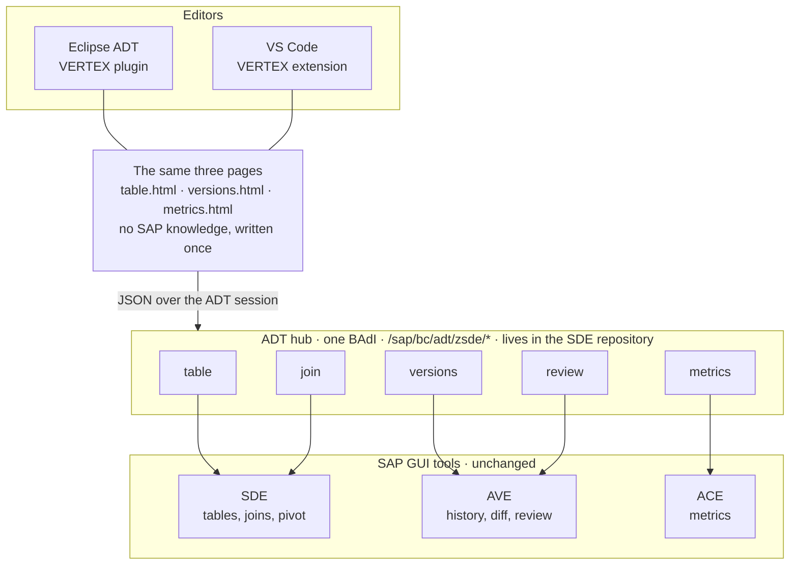

# ABAP VERTEX Tools


[**Install from the VS Code Marketplace**](https://marketplace.visualstudio.com/items?itemName=YuriiSychov.vertex-abap) · Eclipse ADT: install from `https://ysichov.github.io/VERTEX/` or build it from this repository (see below).


ABAP **Version**, **Code** and **Data** Explorer — three words, three SAP GUI tools, one front end
in ABAP Development Tools. Each view reads over the developer's existing ADT connection and
renders as HTML.

| Word | Backend | What it does | In VERTEX | Status |
|---|---|---|---|---|
| Data | [Simple Data Explorer](https://github.com/ysichov/Simple-Data-Explorer) | Tables, views and CDS with select-options, joins, pivot | SelecTor | A table with filters, a join built from the dictionary's own foreign keys, and a pivot over either |
| Version | [AVE](https://github.com/ysichov/AVE) | History, diff, blame, code review of a whole transport | Versions | A transport, a package or one object; its parts, their versions, the diff between two of them, and the review AVE saved for a request — including approving, declining and commenting on a block. No blame |
| Code | [ACE](https://github.com/ysichov/ACE) | Metrics, call maps, backward slicing, skeletons | Metrics | McCabe, Halstead and the maintainability index per unit |

Status: **early**. All three answer, and each is a fraction of what its backend can do.

The division of labour is the same for all three: ABAP computes and returns JSON, the page
renders it, and the view in between is transport. Nothing about a service lives in the host, so
every page runs under the VS Code extension in `vscode/` as well — the same files, from the same
folder. And since SAP GUI 8.0 draws on the same WebView2 engine as both editors, one day inside
SAP GUI too.


## How it fits together




Every service registers under the one `/zsde/` prefix, because that prefix is where the ADT
node is claimed and not the identity of the service: a second one would mean a second BAdI
implementation and a second filter to get wrong. The hub lives in the
[Simple Data Explorer](https://github.com/ysichov/Simple-Data-Explorer) repository even for
the resources that read AVE and ACE, so there is one thing to install and one registration to
make.

The page receives finished JSON and knows nothing about SAP. That is what makes the second
host possible: `vscode/extension.js` reads the very same files and answers them over plain
HTTPS, and the markup, grids and filters are not written twice.

## Installing it in Eclipse

Installing, and getting back out when a p2 install goes wrong: **[INSTALL.md](INSTALL.md)**.
Read it before the first install into an Eclipse you care about.

**Help → Install New Software → Add → Location**, and this address:

```
https://ysichov.github.io/VERTEX/
```

The category **ABAP VERTEX Tools** appears, with the feature under it and its sources beside
it. ADT has to be installed first: the feature declares the SAP bundles as prerequisites
rather than shipping them, so p2 refuses the install on an Eclipse without ADT instead of
leaving a plugin that cannot resolve.

Then **Window → Show View → Other… → VERTEX**, or right-click an object in the Project
Explorer → **VERTEX**.


Building the update site and the VS Code package: **[BUILD.md](BUILD.md)**.

## In VS Code

Published as
[**YuriiSychov.vertex-abap**](https://marketplace.visualstudio.com/items?itemName=YuriiSychov.vertex-abap):
install it from the Extensions view and there is nothing to build.

To run the copy in `vscode/` instead, open that folder in VS Code and press F5. It has no
dependencies and no build step; `vscode:prepublish` copies the pages in from the Eclipse plugin
when the package is made, and a checkout reads them across the repository. **Do not** install it
by making a junction into `%USERPROFILE%\.vscode\extensions` — a folder not named
`publisher.name-version` is loaded on every scan and cannot be uninstalled, which is a trap worth
naming because this project fell into it.

It needs the connection Eclipse inherits from the ABAP project. There is no project here, so the
systems are a list and one of them is active:

```json
"vertex.systems": [
  { "name": "A4H", "url": "https://host:44300", "client": "001", "user": "DEVELOPER",
    "allowInsecureCertificate": true },
  { "name": "EXX", "url": "http://host:8XXX", "client": "100", "user": "DEVELOPER" }
],
"vertex.active": "A4H"
```

The url is the ICM port, not the one SAP GUI connects to. An empty `vertex.active` means the
first. **VERTEX: Switch System** picks another one from a list, and the password is asked once per
system - two systems are two users often enough.

Then the command palette: **VERTEX: Open SelecTor**, **Open Metrics**, **Open Versions**. There is
no object tree here to right-click, so each page opens empty and its own name field is the way in.

## Talking to ADT

Reading and writing an ADT resource from Java, the WebView2 callback deadlock, and how to read
signatures off the bundles when web search has nothing: [ADT_TECH.md](ADT_TECH.md).

## Layout

```
org.vertex.abap.ui/
├── META-INF/MANIFEST.MF   bundle dependencies
├── plugin.xml             registers the view at org.eclipse.ui.views
├── build.properties       resources/ must be listed, or the page is missing at runtime
├── resources/
│   ├── table.html         the grid, the join builder and the pivot cross
│   ├── metrics.html       the metrics table, sortable by any column
│   └── versions.html      parts, their versions, the diff, and the saved review
└── src/org/vertex/abap/ui/
    ├── PageView.java           browser, page, ADT read, answer bridge - the shared half
    ├── SelectorView.java       table data: what to request, and opening a second window
    ├── MetricsView.java        code metrics: what to request
    ├── VersionsView.java       version history: parts, then the versions of one
    ├── ServiceHandler.java     context menu -> a view, on the object's own system
    ├── DataHandler.java        which view, and what to carry in its secondary id
    ├── MetricsHandler.java     the same, for metrics
    ├── VersionsHandler.java    the same, for versions
    ├── SelectionContext.java   the ADT object and project behind a workbench selection
    └── JsonContentHandler.java reads a JSON response body as a String
```

A view is transport and nothing else: it names a path and hands the answer to its page. What the
user operates lives in the page, which is what lets the same page run under the VS Code host in
`vscode/`.

## Next

- Authorization on the ABAP side. The table resource lets any authenticated user read any
  transparent table; `S_TABU_DIS` / `S_TABU_NAM` are not checked anywhere yet. `SE16N` resolves
  both through `VIEW_AUTHORITY_CHECK`, and a refusal has to be a real 403 rather than an empty
  result.
- Paging and a refresh button for the grid. Sorting a column sorts the rows that were read, which
  is what the SAP GUI grid does too; the row limit is still a constant in the page and the
  resource has no offset, so a large table stops at the first hundred rows.
- Conversion exits and F4. Values arrive as stored, so an `ALPHA`-padded key reads as padded.
- Filters on a joined table. The selection panel knows the base table's columns; the join's own
  are filterable by the resource already, and wait for the panel to learn their names.
- `ORDER BY` for the join, and editing an ON condition rather than taking what the dictionary
  proposes.
- The character-level highlight inside a changed line, and the pass that pairs a deletion with the
  insertion it belongs to. Both exist in AVE already, in the ABAP and in its browser port; see
  stage 12 of `dev_history.md` for why neither was copied wholesale.
- Blame.
- `C_ALLOW_SELF_REVIEW` in the review resource is on for testing and has to come out: AVE refuses
  to let a developer approve their own block, and so should this.
- Optimistic locking is one-sided. A write is refused when the review moved under the page, which
  is right, but AVE's own save still overwrites without looking.
- The metrics of a whole package, which needs the same treatment the transport just got.
- The DDIC side of a review. `TABD`, `DOMD` and `DTED` have no line diff, and their page in AVE is
  a field table kept as ready-made html; VERTEX says so rather than rendering it.
