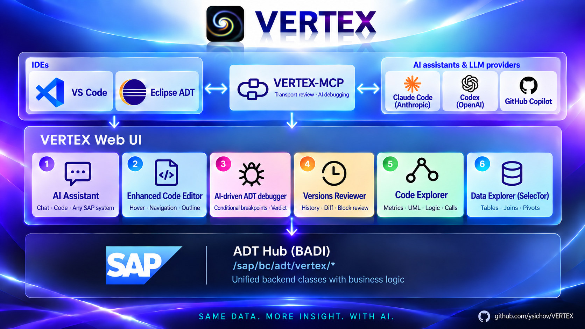

# ABAP VERTEX Tools

VERTEX is a set of plugins for VS Code and Eclipse ADT: an AI assistant with MCP, an enhanced ABAP
editor, an AI-driven ADT debugger, and explorers for code, versions and data. Each window reads over
the developer's existing ADT connection and renders as HTML; the ABAP side is this repository's
`src/`.

| Tool | Grew out of | What it does | VS Code | Eclipse |
|---|---|---|---|---|
| **AI Assistant** | [ABAP-AI-Code](https://github.com/ysichov/ABAP-AI-Code) | Chat over any configured SAP system; code changes land in the tab, reviewed block by block before activation | ✓ | ✓ |
| **Enhanced Code Editor** | — | Hover, navigation, outline, ABAP Unit, ATC, where-used, keyword documentation | ✓ | — |
| **AI-driven ADT debugger** | [Smart Debugger](https://github.com/ysichov/Smart-Debugger) | Conditional breakpoints and a verdict from the assistant; Visual Debug on screen | ✓ | — |
| **Versions** | [AVE](https://github.com/ysichov/AVE) | History, diff, code review of a whole transport | ✓ | ✓ |
| **Code Explorer** | [ACE](https://github.com/ysichov/ACE) | Metrics, UML, logic, calls | ✓ | ✓ |
| **Data Explorer (SelecTor)** | [Simple Data Explorer](https://github.com/ysichov/Simple-Data-Explorer) | Tables, joins, pivots | ✓ | ✓ |

The projects named above are where the ideas were worked out first, and they are not developed
further; everything new happens here.



## Install

**[VS Code — the Marketplace](https://marketplace.visualstudio.com/items?itemName=YuriiSychov.vertex-abap)**
· **[Eclipse ADT — the update site](https://ysichov.github.io/VERTEX/)**

### VS Code

Install the extension from the Marketplace, then give it the connection Eclipse would take from the
ABAP project. There is no project here, so the systems are a list and one of them is active:

```json
"vertex.systems": [
  { "name": "A4H", "url": "https://host:44300", "client": "001", "user": "DEVELOPER",
    "allowInsecureCertificate": true },
  { "name": "EXX", "url": "http://host:8XXX", "client": "100", "user": "DEVELOPER" }
],
"vertex.active": "A4H"
```

The url is the ICM port, not the one SAP GUI connects to. An empty `vertex.active` means the
first. **VERTEX: Switch System** picks another one from a list, and the password is asked once per
system - two systems are two users often enough.

### Eclipse

The update site address is pasted into **Help → Install New Software → Add → Location**; the
steps, and getting back out when a p2 install goes wrong, are in [INSTALL.md](INSTALL.md). VERTEX
then opens from **Window → Show View → Other… → VERTEX**, or right-click an object in the Project
Explorer → **VERTEX**.

### SAP

On the SAP system, nothing but this repository's `src/` has to be installed: pull it with
[abapGit](https://abapgit.org) and activate it. Until then every VERTEX window shows a page saying
the backend is missing. The table, the join and the pivot were
carried out of Simple Data Explorer, the flow and the metrics out of ACE, and the version history,
the diff, the transport lookup and the review out of [AVE](https://github.com/ysichov/AVE) — all
into `src/` as `ZCL_VX_*`, with the SAP GUI stripped off. None of the three is a prerequisite any
more: they are where the logic was written first, and they are not developed further — everything
new happens on this side. The `ZAVE_REVIEW` table the review is kept in ships in `src/` as well.

Building either half from this repository instead: [BUILD.md](BUILD.md).

## What each host has

### VS Code

- **VERTEX Tools** — pick an object type and a name; the functions offered depend on the type
  (Data, View source, UML, Metrics, Calls and Logic diagrams, Diff, Versions, Visual Debug).
- **The ABAP editor** — hover, Go to, outline, Save & Activate and the block-by-block
  Review & Activate; Ctrl+Shift+F10 runs ABAP Unit into the Test Explorer, Ctrl+Shift+F2 runs ATC
  into the Problems view, Shift+F12 shows where-used, F1 opens the keyword documentation.
- **VERTEX chat** — Claude or ChatGPT through a subscription or an Anthropic API key, over every
  system in `vertex.systems`; it reads, explains and changes code, and nothing reaches SAP until
  you save.
- **The debugger for an assistant** — *Z_CALC computes the wrong discount, find out why*: the
  assistant sets conditional breakpoints, runs the program in WebGUI and ends with the line and the
  values that prove it. Visual Debug shows the same session on screen, with a flow chart of the
  calls and a player for the recorded run.
- **Assistant in SelecTor and Versions** — a sentence instead of the clicks: *SFLIGHT for carrier
  AA, joined with SCARR*.

Everything, with its settings and commands: [vscode/README.md](vscode/README.md).

### Eclipse ADT

- **VERTEX Tools** — the same pages as in VS Code, opened from **Window → Show View → VERTEX** or
  the context menu of an object, on that object's own ADT project.
- **VERTEX Assistant** — the chat over the ABAP project's system, and the Assistant panels in
  SelecTor and Versions, run by Codex or Claude Code.
- **VERTEX: Activate** — ADT's activation, optionally after the block review.

Setup of the assistant: [eclipse/README.md](eclipse/README.md).

### Other assistants over MCP

GitHub Copilot, Claude Code and Codex get two read-only tools for transport reviews:
`sap_transport_changes` lists what a request changed, and `sap_transport_diff` gives the diff in
review blocks with the verdicts already given. The VS Code extension serves them itself; without VS
Code, [mcp/](mcp/README.md) serves them over stdio. Setup:
[in VS Code](vscode/README.md#review-transports-with-copilot-claude-code-or-codex) ·
[Copilot in Eclipse](eclipse/MCP.md) · [without VS Code](mcp/README.md). The tested clients are
Copilot in VS Code, Claude Code and Codex; others are not supported yet.

## The explorers today

| Word | Comes from | What it does | In VERTEX | Status |
|---|---|---|---|---|
| Data | [Simple Data Explorer](https://github.com/ysichov/Simple-Data-Explorer) | Tables, views and CDS with select-options, joins, pivot | SelecTor | A table with filters, a join built from the dictionary's own foreign keys, and a pivot over either |
| Version | [AVE](https://github.com/ysichov/AVE) | History, diff, blame, code review of a whole transport | Versions | A transport — by its number, or picked from the open or released requests of a user, yours by default — a package or one object; its parts, their versions, the diff between two of them, and the review saved for a request — including approving, declining and commenting on a block. No blame |
| Code | [ACE](https://github.com/ysichov/ACE) | Metrics, call maps, backward slicing, skeletons | Metrics | Three modes: the flow of a program, the branch scheme of one method, and McCabe, Halstead and the maintainability index per unit |

Status: **early**. All three answer, and each is a fraction of what it was cut from.

Building a review is here too, not only reading one. A Versions window opened on a request that
has none offers to build it, and walks the objects one at a time — reading the versions of each,
diffing them, cutting what changed into blocks — writing each object before it moves to the next.
One object per call, so nothing has to survive being slow and stopping costs the object in hand.
AVE's SAP GUI writes into the same `ZAVE_REVIEW`, so a review built either way is read by both.

## How it fits together

The division of labour is the same for all three: ABAP computes and returns JSON, the page
renders it, and the view in between is transport. Nothing about a service lives in the host, so
every page runs under the VS Code extension in `vscode/` as well — the same files, from the same
folder. And since SAP GUI 8.0 draws on the same WebView2 engine as both editors, one day inside
SAP GUI too.

Every service registers under the one `/vertex/` prefix, because that prefix is where the ADT
node is claimed and not the identity of the service: a second one would mean a second BAdI
implementation and a second filter to get wrong. The hub lives in this repository, under
`src/`, together with everything the windows read except the review — so there is one thing
to install and one registration to make. The prefix used to be `/zsde/`, from the repository
the hub was first built in; that hub is gone, and a system still carrying it answers each prefix
under its own filter.

The page receives finished JSON and knows nothing about SAP. That is what makes the second
host possible: `vscode/extension.js` reads the very same files and answers them over plain
HTTPS, and the markup, grids and filters are not written twice.

### Talking to ADT

Reading and writing an ADT resource from Java, the WebView2 callback deadlock, and how to read
signatures off the bundles when web search has nothing: [ADT_TECH.md](ADT_TECH.md).

### Layout

What each folder and file of the repository is for: [BUILD.md](BUILD.md#repository-layout).

## Acknowledgements

The VS Code extension talks to SAP ADT through
[abap-adt-api](https://github.com/marcellourbani/abap-adt-api) by Marcello Urbani (MIT): reading
and writing source, activation, the debugger, ABAP Unit, ATC, where-used, keyword documentation. It travels inside the VSIX with its
licence, as do the other npm packages it depends on (MIT, Apache-2.0, BSD-3-Clause), each in its
own folder. The Eclipse plugin does not use it: it works through the platform and ADT only.

## Next

- Authorization on the ABAP side. The table resource lets any authenticated user read any
  transparent table; `S_TABU_DIS` / `S_TABU_NAM` are not checked anywhere yet. `SE16N` resolves
  both through `VIEW_AUTHORITY_CHECK`, and a refusal has to be a real 403 rather than an empty
  result.
- Paging and a refresh button for the grid. Sorting a column sorts the rows that were read, which
  is what the SAP GUI grid does too; the row limit is still a constant in the page and the
  resource has no offset, so a large table stops at the first hundred rows.
- Conversion exits and F4. Values arrive as stored, so an `ALPHA`-padded key reads as padded.
- Filters on a joined table. The selection panel knows the base table's columns; the join's own
  are filterable by the resource already, and wait for the panel to learn their names.
- `ORDER BY` for the join, and editing an ON condition rather than taking what the dictionary
  proposes.
- The character-level highlight inside a changed line, and the pass that pairs a deletion with the
  insertion it belongs to. Both exist in AVE already, in the ABAP and in its browser port; see
  stage 12 of `dev_history.md` for why neither was copied wholesale.
- Blame.
- `C_ALLOW_SELF_REVIEW` in the review resource is on for testing and has to come out: AVE refuses
  to let a developer approve their own block, and so should this.
- Optimistic locking is one-sided. A write is refused when the review moved under the page, which
  is right, but AVE's own save still overwrites without looking.
- The metrics of a whole package, which needs the same treatment the transport just got.
- The DDIC side of a review. `TABD`, `DOMD` and `DTED` have no line diff, and their page in AVE is
  a field table kept as ready-made html; VERTEX says so rather than rendering it.
- The join as a graph in SelecTor, drawn as the page's own svg. The candidates already carry their
  direction and their parent, and the joined tables their ON condition, so the nodes and the edges
  are in the join resource's answer already and only the drawing is missing. Not mermaid, which
  ships here for Flow and Metrics: a node has to be clickable to take its table into the join, and
  a rendered picture is not. The view stays egocentric, the join so far in the middle and one step
  of candidates around it, because `DD08L` offers dozens of them around a table like `BKPF`.
