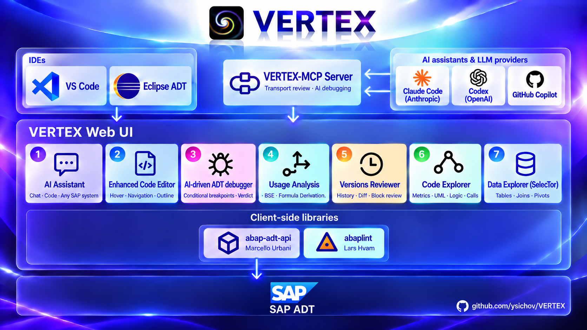

# Built-in Eclipse Assistant

The VS Code 0.7.10 Value Origin loader distinguishes foreign class declarations from complete implementations. Its Type is now FLOW or Formula, with a Depth slider that opens the tree along the call stack or along the derivation. Both are client changes and require no additional Eclipse build.

The shared diagram pages changed too, and they are the same pages this plugin shows. A method
clicked in the Calls diagram now draws its Logic diagram inside that canvas, joined to the block
it came from. The magnifier is an explicit *Lens off* / *Lens on* toggle in the diagram toolbar
instead of a rule that measured the text on screen, and Shift with the wheel sets its strength.
A Logic diagram no longer emits a node for a statement whose text is left with nothing to show —
one such empty node was a mermaid syntax error that failed the whole diagram. Eclipse was not
rebuilt for these; they arrive with the next build of this plugin.

The VS Code 0.7.10 test build includes ACE-backed Value Origin analysis in its ABAP
editor. It requires the updated `ZCL_VX_ADT_RES_FLOW` backend (`mode=origin`).
That backend also supplies ACE's concrete class-to-interface relation for interface dispatch.
It labels the owner of every ACE include so VS Code can load a foreign class's complete pool.
The VS Code navigation layer does not open an interface `METHODS` declaration for an invocation.
It also keeps ordinary contextual navigation in the same VS Code editor group.
This analysis UI, including standard VS Code editor navigation and gutter-breakpoint
synchronization, is not available in Eclipse; no Eclipse release was built for it.
The VS Code-only right-hand Visual Debug panel, its stopped-line highlight and
its F5-F8 source-editor shortcuts are also not available in Eclipse.



The Selector and Versions Assistant panels launch Codex or Claude Code directly.
Copilot is not involved. The existing standalone MCP registration is independent.

For **GitHub Copilot Chat in Eclipse**, see [VERTEX MCP setup](MCP.md).

1. Install Node.js 22 or newer.
2. Install and log in to Codex CLI or Claude Code. The assistant runs on your
   ChatGPT or Claude subscription, and a subscription has no public API: it
   works only through the vendor's own client, so without one of them the
   Assistant cannot answer. Existing VS Code extension binaries are also
   discovered automatically; VS Code need not be running.
3. Open **Window > Preferences > VERTEX Assistant**. Set the Node executable
   if `node` is not on Eclipse's PATH. Optionally select native Codex/Claude
   executables; on Windows select `.exe`, not `.cmd` wrappers.
4. Open Selector or Versions on your ABAP project and click **Assistant**.
   Choose the assistant/model and send a request. For Claude the list holds the
   newest model of each family by full id (Haiku, Sonnet, Opus, Fable); another
   version is added with **Specify version...**, which checks it with one short
   request before keeping it.

SAP reads use that window's ADT project and login. No SAP password is put into
the child environment or its temporary files. Each request starts a private,
authenticated loopback MCP server and uses the same tools, instructions,
schema and plan validation as VS Code. Selector receives metadata only.
Validated plans are applied by the existing HTML page.

Model discovery and CLI work run in background threads. Closing the view stops
its child processes. A request has an overall five-minute deadline (including
metadata preparation); the model call retains its existing three-minute limit.
If a CLI is missing, configure its executable here and log in externally first.

Build: run `node eclipse/prepare.js` before PDE export. The generated
`org.vertex.abap.ui/assistant/` files are committed so an ordinary Eclipse export
also includes the runtime. Edit their originals in `vscode/` and `eclipse/`,
then regenerate. The feature and bundle are at `0.7.3.qualifier`; the VS Code extension is at
0.7.10, and the shared explorer pages in this plugin are the 0.7.3 copies until it is exported
again.

For a local installable archive without replacing the published `docs/` site:

```powershell
./eclipse/package.ps1 -Javac 'path/to/javac.exe' -BundlePool 'path/to/.p2/pool/plugins'
```

This compiles Java 21 classes, uses the existing PDE repository as the
metadata template, and creates a new timestamped site and ZIP under `target/`.
It refreshes bundled resources, sources, versions and SHA-256 download checksums.
Install via **Help > Install New Software > Add > Archive** and restart Eclipse.
